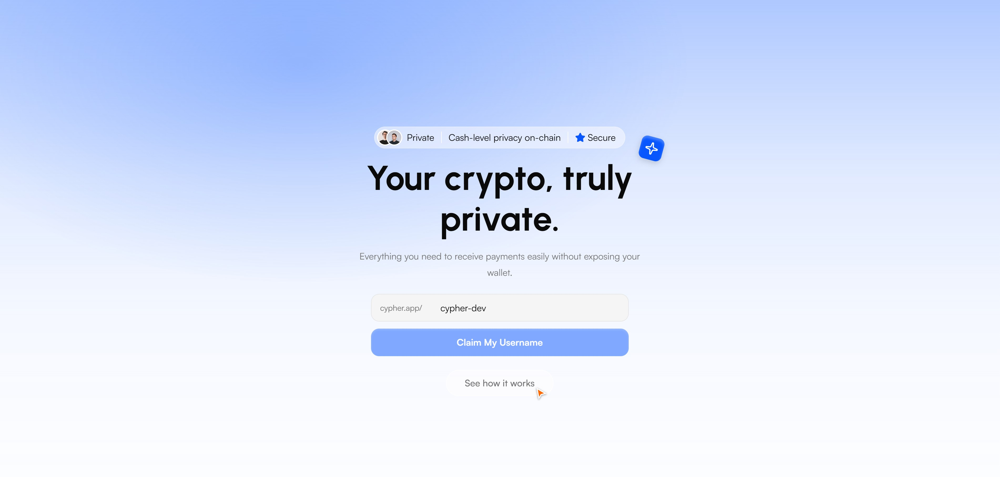
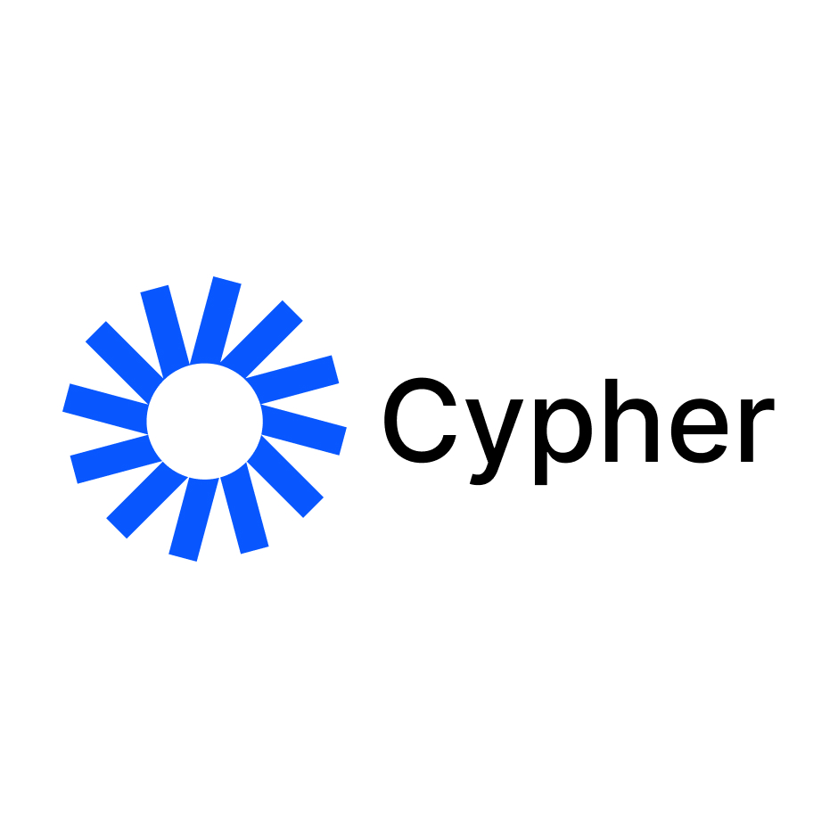
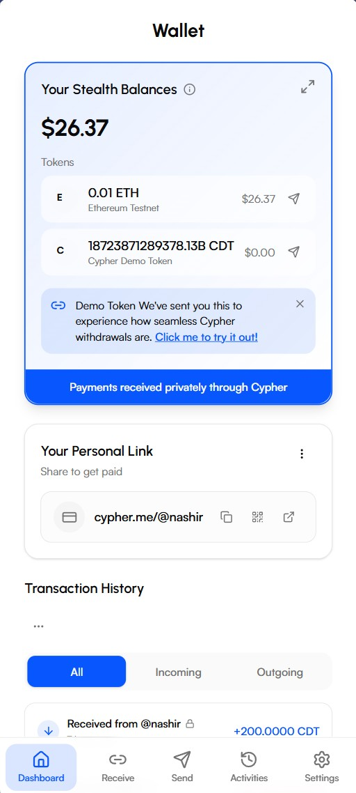
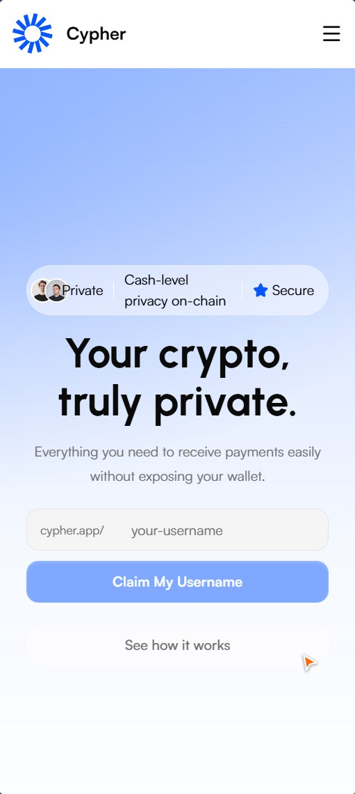

# 🔐 Cypher - Your Crypto, Truly Private



[](https://nextjs.org/)
[](https://base.org/)
[](https://privy.io/)
[](https://react.dev/)

Cypher is a privacy-focused crypto wallet built to work seamlessly on Base. It enables receive-by-username, private balances, and stealth addresses so that transaction history and balances stay off public ledgers.

The platform provides a complete wallet experience including a landing page with username claiming, onboarding with PIN, and full send/receive/scan flows. Balances and transaction history are derived from stealth metadata and your keys—only you see your full picture. With deterministic key derivation (wallet + PIN) and on-chain stealth contracts, Cypher delivers cash-level privacy on-chain without complexity.

## 🎯 Why Cypher?

Cypher addresses urgent challenges in crypto privacy and usability:

- **Public ledgers expose everything** — Wallet addresses, balances, and full transaction graphs are visible to anyone. Receiving payments often means exposing your identity and history.
- **Usability vs. privacy tradeoff** — Existing privacy tools are complex; simple wallets offer no privacy. Users either sacrifice privacy or struggle with steep learning curves.
- **No simple "receive by name"** — Sending crypto usually means copying long addresses, with high error risk and no built-in privacy for recipient or sender.

Our solution introduces **Cypher**, a privacy-focused wallet that uses stealth addresses so you can send to usernames without exposing transaction history or balance on the blockchain. Balances and history stay off public ledgers. Only you see what you hold and where it went. With familiar send, receive, and scan flows using QR and usernames, Cypher empowers users to transact with privacy without complexity.

## 📚 Complete Resources

- Docs: [Cypher Wallet Documentation](docs/README.md)
- Deterministic Keys (EN): [DETERMINISTIC_KEYS_EN.md](docs/DETERMINISTIC_KEYS_EN.md)
- Deterministic Keys (ID): [DETERMINISTIC_KEYS_ID.md](docs/DETERMINISTIC_KEYS_ID.md)
- Previews: Screenshots and assets in [previews/](previews/)

## 🌟 Features of Cypher



### Cypher Wallet (Web App)

Cypher Wallet is the gateway to private crypto on Base.
Available as a **web app**, it provides a simple interface for send, receive, and scan with built-in privacy.

- Manage balances and history derived from stealth metadata—not from public addresses.
- Supports **Base** (Base Sepolia for testing).
- Stealth addresses are computed on-chain; only you and the counterparty can link transactions.
- **Send by username** — no long addresses to copy or leak.
- View **transaction history** only inside the app; nothing exposed on public explorers.

---

### Stealth Addresses

Send to usernames without exposing wallet addresses. Recipients get funds to a one-time stealth address only they can derive.

- Username-based addressing; no long addresses to copy or leak.
- Stealth metadata and announcements handled on-chain (Base).
- One derived address per interaction; only the recipient can spend.

---

### Private Balances

Your balance and transaction history stay off public ledgers. Only you see what you hold and where it went.

- Balances derived from stealth metadata and your keys, not from public addresses.
- Transaction history visible only to you inside the app.
- No public balance or graph exposure on-chain.

---

### Send by Username

No long addresses to copy. Send to a simple username; we handle the stealth math on-chain.

- Claim a username at `cypher.app/your-username` from the landing page.
- Send and receive using usernames; stealth addresses are computed under the hood.
- QR and username flows for familiar wallet UX.

---

### Recovery & Security

Recover access with your chosen method. Keys and metadata stay under your control with built-in safeguards.

- Two-factor security: wallet ownership (signature) + user PIN.
- Deterministic key derivation: keys recoverable from wallet + PIN; no database needed for key material.
- Recovery flows documented in [docs](docs/README.md).

---

### On-Chain Privacy

Stealth announcements and registries on Base so transactions don't link back to your identity.

- Stealth announcement and registry contracts on Base (Base Sepolia for testing).
- Transactions don't tie back to your identity on public explorers.
- Cash-level privacy on-chain.

---

### Simple Wallet UX

Familiar send, receive, and scan flows with QR and usernames—privacy without complexity.

- Dashboard, balances, and asset list.
- Send (with confirm and success), receive (QR), scan, and history.
- Settings, notifications, and Farcaster miniapp support.

---

## 📸 Screenshots

| Landing                                        | App                                                |
| ---------------------------------------------- | -------------------------------------------------- |
|  |  |
| _Claim a username and get started_             | _Dashboard and balances_                           |
|                                                |  |
|                                                | _Send, receive, and transactions_                  |

---

## 🚀 Build and Deployment Instructions

### Prerequisites

- [ ] Node.js 18 or higher.
- [ ] npm, yarn, pnpm, or bun.
- [ ] (Optional) Environment variables for Privy and chain config if you run against a live network.

Begin by opening a terminal window.

### Install dependencies

```bash
npm install
```

### Run development server

```bash
npm run dev
```

The dev server runs with `-H 0.0.0.0` so it is reachable on your network. Open [http://localhost:3000](http://localhost:3000) in your browser.

### Setup Application (Production)

- Build the application

  ```sh
  npm run build
  ```

- Start the application

  ```sh
  npm run start
  ```

- Other scripts

  ```sh
  npm run lint          # Run ESLint
  npm run lint:fix      # Fix lint issues
  npm run format        # Format with Prettier
  npm run format:check  # Check formatting
  ```

---

## 🏗️ Architecture Overview

Cypher is built as a Next.js web app on Base, combining stealth address contracts, deterministic key derivation, and a simple wallet UX into a privacy-first experience. The app keeps balances and history off public ledgers while still using on-chain stealth announcements and registries.

### 🔹 Project Structure

The codebase is organized around the Next.js App Router, with separate route groups for authenticated app, auth flows, and transaction flows (send, receive, scan, history).

```
cypher-apps/
├── app/                    # Next.js App Router
│   ├── (app)/              # Authenticated app (dashboard, settings, etc.)
│   ├── (auth)/             # Auth flows (login, onboarding, recover, verify)
│   ├── (transactions)/     # Send, receive, scan, history
│   └── api/                # API routes (e.g. register-username)
├── components/             # React components (UI, layout, landing, wallet)
├── hooks/                  # Shared hooks (auth, wallet, balances, etc.)
├── lib/                    # Blockchain, constants, schemas, utils
├── providers/              # Auth, Balance, Privy providers
├── sections/landing/       # Hero, stats, features, FAQ
├── data/landing/           # Landing copy (features, FAQs, links)
├── previews/               # Screenshots and assets for README
└── docs/                   # Deterministic keys and wallet docs
```

### 🔹 User Flow

Users land on the homepage, claim a username, onboard with wallet + PIN, and then use the app to send (by username), receive (QR), and scan. Balances and history are derived client-side from stealth metadata and keys—only the user sees their full picture.

---

## 🔥 Complex Features Implemented

- **Stealth Addresses on Base**: On-chain stealth announcement and registry contracts so that payments to usernames resolve to one-time stealth addresses; only sender and recipient can link transactions.
- **Deterministic Key Derivation**: Keys recoverable from wallet (signature) + user PIN; no server-side storage of key material; recovery and re-derivation documented.
- **Private Balances & History**: Balances and transaction history derived from stealth metadata and user keys; no public address balance or graph exposure on explorers.
- **Send by Username**: Claim a username on the landing page; send and receive using usernames with QR and in-app flows; stealth math handled on-chain.
- **Privy Auth**: Embedded wallet and social login via Privy for a simple onboarding experience.
- **Farcaster Miniapp**: Support for Farcaster miniapp so users can access Cypher from compatible clients.

---

## 🛠️ Tech Stack

| Layer     | Technology                                               |
| --------- | -------------------------------------------------------- |
| Framework | [Next.js 16](https://nextjs.org) (App Router)            |
| Auth      | [Privy](https://privy.io)                                |
| Chain     | [Base](https://base.org) (Base Sepolia for testing)      |
| UI        | React 19, Tailwind CSS 4, Radix UI, Framer Motion, Lenis |
| Wallet    | Ethers.js, deterministic key derivation (wallet + PIN)   |
| Other     | Farcaster miniapp SDK, QR (qrcode.react, html5-qrcode)   |

---

## 📃 License

Private. See repository settings for terms.
